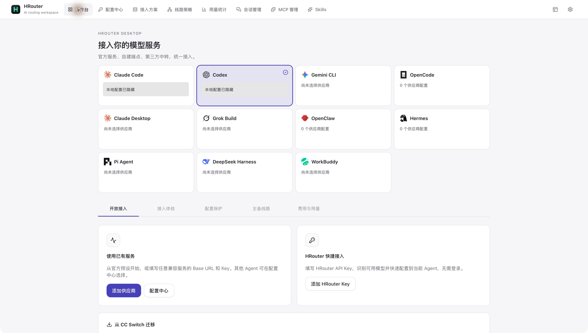
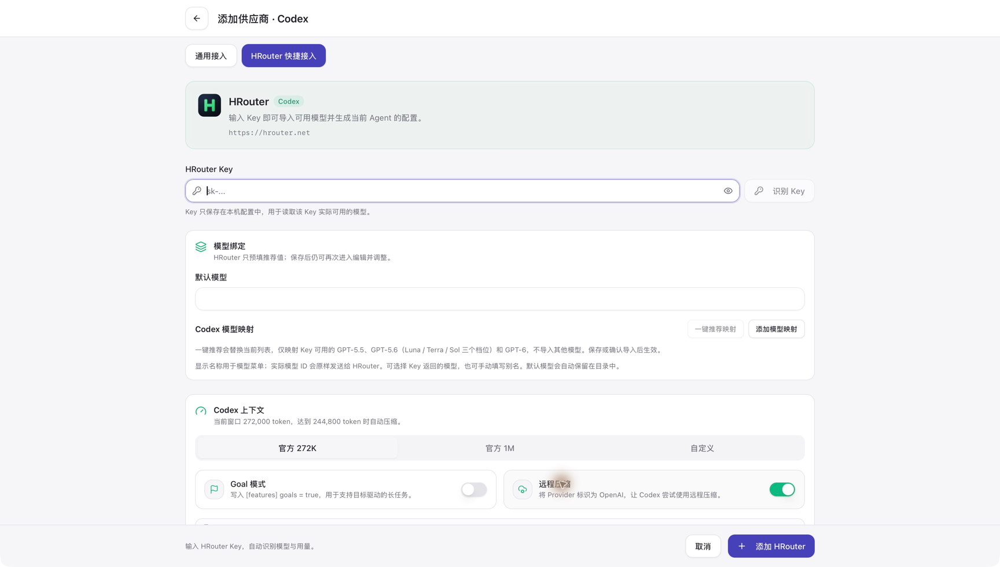
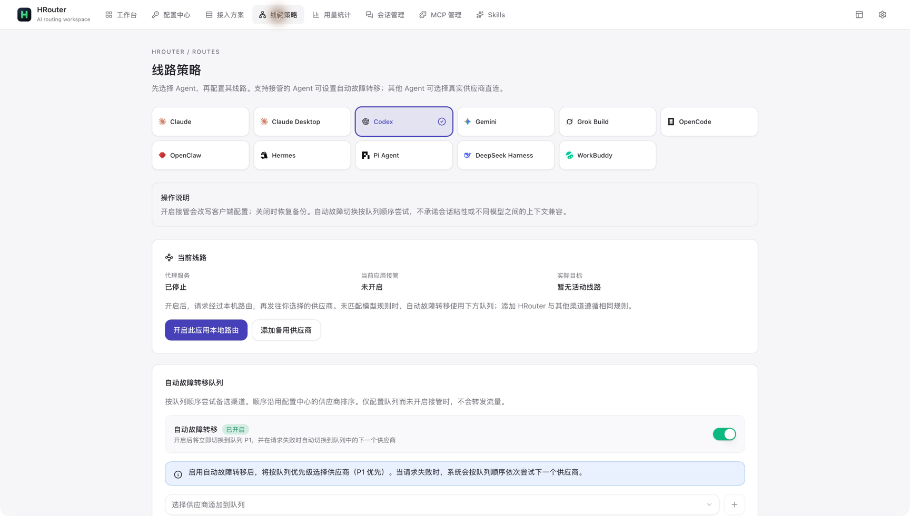

<div align="center">


# HRouter Desktop

**专注 AI 编程工具接入，保持工具干净。**

一个本地优先的桌面配置工作台，集中管理供应商、API Key、模型和线路。
支持你选择的模型服务；HRouter 仅作为可选的 Key 快捷配置保留。

[下载最新版](https://github.com/honestTai/HRouter-Desktop/releases/latest) · [快速开始](#快速开始) · [界面预览](#界面预览) · [更新记录](CHANGELOG.md) · [English](#english)

</div>



## 下载

**当前版本：v0.4.0**

| 平台 | 安装包 | 说明 |
| --- | --- | --- |
| macOS | [下载 Universal DMG](https://github.com/honestTai/HRouter-Desktop/releases/download/v0.4.0/HRouter_0.4.0_universal.dmg) | Apple Silicon / Intel，macOS 12+ |
| Windows | [下载 x64 EXE](https://github.com/honestTai/HRouter-Desktop/releases/download/v0.4.0/HRouter_0.4.0_x64-setup.exe) | NSIS 安装程序 |

[全部版本与附件](https://github.com/honestTai/HRouter-Desktop/releases) · [v0.4.0 发布说明](.github/release-notes/v0.4.0.md)

macOS 正式安装包通过 Developer ID 签名与 Apple 公证。应用内更新使用带签名的更新包；**更新包签名不等同于 Windows Authenticode 签名**。详见[签名政策](CODE_SIGNING_POLICY.md)。

## 这个工具做什么

不再把模型服务网站装进桌面应用。**没有内置平台登录、充值、订单、账户管理或云端账单模块**，核心流程是：

**选择 Agent → 添加供应商或粘贴已有 Key → 配置模型 → 按需启用线路与配置保护。**

| 能力 | 用途 |
| --- | --- |
| 统一接入 | 管理官方预设、自建端点和兼容 API 服务；一个 Agent 可保存多套供应商配置。 |
| HRouter Key 快捷配置 | 无需平台登录，填写已有 Key、发现可用模型、调整映射并保存。 |
| 接入方案 | 保存并切换 Agent 的接入配置，以及相关 MCP / Skills 设置。 |
| 线路策略 | 配置主备线路、按模型匹配与自动故障转移；不会自动加入未选择的渠道。 |
| 配置保护 | Claude Code / Codex 可预览变更、保存快照并检查恢复冲突；另有 Lite 模式和提示词保护。 |
| 本地用量 | 查看请求、Token、趋势与费用估算；可查询供应商配置的用量接口。 |
| 日常工具 | 管理会话、MCP、Skills；使用桌面用量窗口和 macOS Agent 小组件。 |
| 配置迁移 | 只读预览 CC Switch 数据库，再导入选中的供应商，不修改源数据库。 |

> **边界说明：**本地费用按配置价格估算，不是服务商的实际账单。模型能力、协议、自动接管和保护范围因 Agent 而异；保存成功不代表所有上游模型都兼容。真实请求体检可能产生费用，需主动选择执行。

## 支持的 Agent

Claude Code · Claude Desktop · Codex · Gemini CLI · Grok Build · OpenCode · OpenClaw · Hermes · Pi Agent · DeepSeek Harness · WorkBuddy

各工具保留独立的配置适配逻辑，不要求它们提供完全相同的功能。具体行为和限制见[接入工作台说明](docs/access-workbench.md)与[修复及验收清单](docs/issue-remediation.md)。

## 界面预览

以下为在 macOS 上直接操作真实桌面应用拍摄的截图，不是网页效果图。涉及凭据、个人路径或账户信息的区域在提交前已检查并遮盖。

### 工作台：先选工具，再选接入方式

顶部切换 Agent，直接添加任意供应商，或使用 HRouter Key 快捷配置。


### HRouter Key：只配置，不登录

填写已有 Key，按需发现模型；也可以手动调整模型映射。不会创建账户、充值或开通付费订单。



### 线路策略：主备与模型路由集中管理

明确选择线路和故障转移顺序，配置前可先进行接入体检。



## 快速开始

1. 从上方下载并安装，打开 HRouter Desktop 的**工作台**。
2. 选择要配置的 Agent。
3. 点击**添加供应商**，选择预设或填写兼容服务的地址与 Key。已有 HRouter Key 则点击**添加 HRouter Key**；没有 Key 可自行在 [HRouter 网站](https://hrouter.net/)管理，不需要在桌面端登录。
4. 检查模型和配置后保存，再启用目标供应商。按 Agent 要求重启或刷新客户端。
5. 如需线路切换、配置保护或用量查询，再按需开启。首次接入建议先查模型目录，确认后再执行可能计费的真实请求测试。

从旧版升级：**无需删除现有 Key、供应商或配置目录**。旧平台页面会自动返回工作台；平台账户业务请在网站操作。

### Codex 历史会话

当前版本为旧代理 provider 标识提供运行时兼容配置，改善切换供应商后会话可见但无法恢复的问题；不重写历史消息、不删除会话。已受影响的配置可能需要重新应用供应商并重启客户端，详见[故障说明](docs/guides/codex-provider-switch-history-fix-zh.md)。

## 隐私与安全

- API Key 和客户端配置保存在本机；查询模型、使用量或发起请求时，凭据会发送到所选择的服务端。
- 同步、技能发现、更新检查等功能只在启用或调用时访问对应服务。
- 配置快照和备份可能包含凭据；分享日志、截图和数据库前请先脱敏。
- 本项目不内置广告、行为分析或向维护者上传的遥测。
- 安全问题请通过 [GitHub Security Advisories](https://github.com/honestTai/HRouter-Desktop/security/advisories/new) 私下报告，不要公开提交真实 Key。

[隐私政策](PRIVACY.md) · [安全政策](SECURITY.md) · [macOS 签名与发布](docs/macos-signing.md)

## 本地开发

使用仓库声明的 Node.js / pnpm 版本，以及 `rust-toolchain.toml` 指定的 Rust 工具链。还需要当前系统的 [Tauri 2 构建依赖](https://v2.tauri.app/start/prerequisites/)。

```bash
git clone https://github.com/honestTai/HRouter-Desktop.git
cd HRouter-Desktop
pnpm install --frozen-lockfile
pnpm dev
```

```bash
pnpm typecheck
pnpm format:check
pnpm test:unit
pnpm build:renderer
cargo fmt --check --manifest-path src-tauri/Cargo.toml
cargo clippy --manifest-path src-tauri/Cargo.toml -- -D warnings
cargo test --manifest-path src-tauri/Cargo.toml
```

`pnpm build` 构建当前平台安装包。macOS 正式包还需要签名与公证配置；Windows 包在 Windows 构建环境生成。发布流程会等待两端安装包和自动更新清单验证完成，再公开新版本。

## 上游与许可证

HRouter Desktop 基于 [CC Switch](https://github.com/farion1231/cc-switch)，沿用 MIT 许可证，并保留原作者版权与归属声明。它是独立发行版，不承诺与上游功能或发布节奏一致。

部分 `cc-switch` 内部标识用于兼容原配置、迁移和历史会话，不代表产品品牌。

[LICENSE](LICENSE) · [NOTICE](NOTICE.md) · [参与贡献](CONTRIBUTING.md)

## English

**A focused, local-first configuration workbench for AI coding agents.**

Manage providers, API keys, models, routing, profiles, and local usage in one desktop app. Use official providers, compatible gateways, or your own endpoints. HRouter is an optional API-key quick setup path—not a required account.

Version 0.4.0 promotes the redesigned workbench to the main branch and removes the embedded account portal, payments, orders, announcements, and cloud billing. Existing provider configurations and keys do not need to be deleted.

- Select an agent, add a provider or paste an existing HRouter key, review models, and enable the configuration.
- Opt into configuration protection, failover routes, usage queries, MCP, Skills, and session tools as needed.
- Local costs are estimates, not provider invoices. Compatibility and configuration-write behavior vary by agent.
- Download Windows x64 or the signed and notarized macOS Universal installer above. Updater signatures are separate from Windows Authenticode signing.

Based on CC Switch and licensed under MIT. See the privacy, security, attribution, and contribution documents linked above.

---

Maintained by [honestTai](https://github.com/honestTai). [反馈问题](https://github.com/honestTai/HRouter-Desktop/issues) · [模型服务](https://hrouter.net/)
