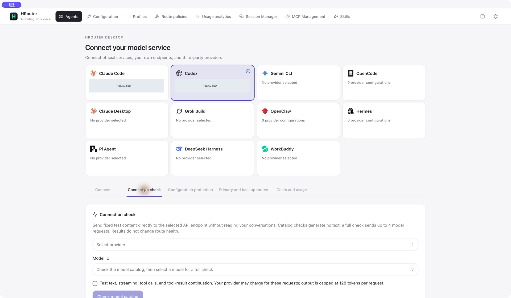
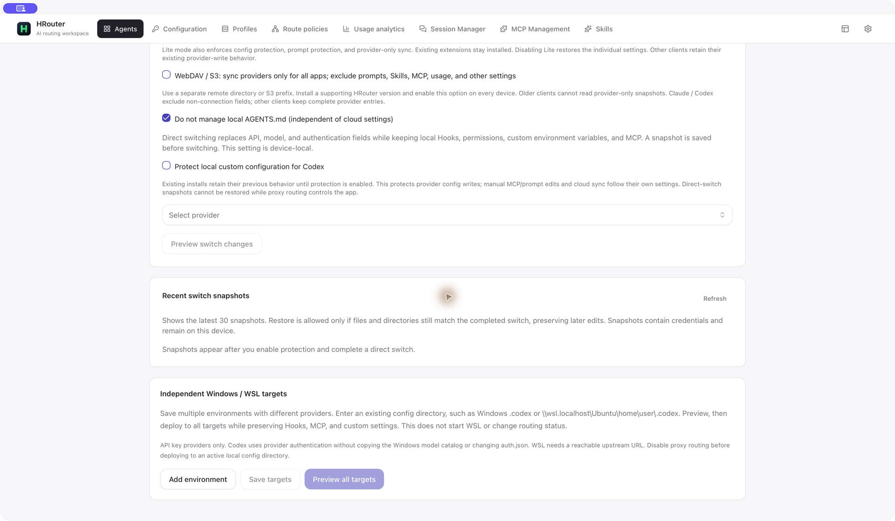
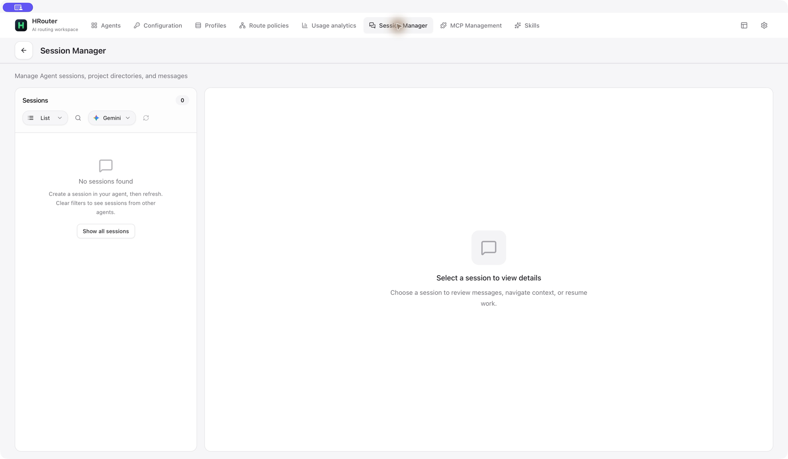
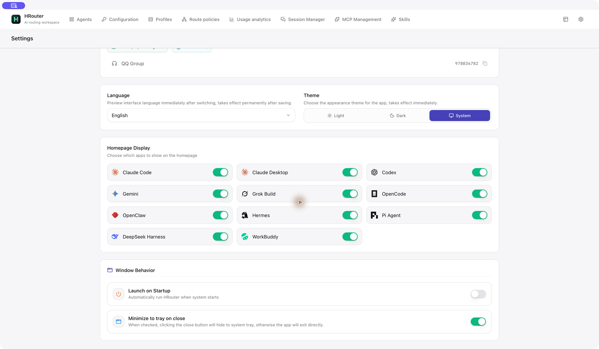

<div align="center">


# HRouter Desktop

English | [简体中文](README_ZH.md)

**Your agents. Your providers. One focused desktop workbench.**

Connect AI coding tools to the model services you choose.<br>
Manage providers, API keys, model mappings, profiles, routing, and usage—without turning your desktop into an account portal.

[Download](https://github.com/honestTai/HRouter-Desktop/releases/latest) · [Features](#features) · [What changed from CC Switch?](#what-changed-from-cc-switch) · [Screenshots](#screenshots)

**macOS · Windows · Local-first · MIT licensed**

</div>


## Meet HRouter

<table>
<tr>
<td width="100" align="center"><a href="https://hrouter.net/"></a></td>
<td>
<strong>Already have an HRouter key? Put it to work.</strong><br><br>
Choose your agent, paste your HRouter API key, discover the models available to that key, and review the generated configuration. Spend less time editing config files and more time building.<br><br>
<a href="https://hrouter.net/"><strong>Visit HRouter →</strong></a> · Manage your service account and keys on the website; configure your coding tools in the desktop app.
</td>
</tr>
</table>

**HRouter is optional.** Official providers, self-hosted endpoints, and other compatible API services remain first-class choices. This is a project-service promotion, not a requirement to buy a plan. Model availability, pricing, and service terms are determined by the service and your key—not by the screenshots or this README.

## Why this fork?

HRouter Desktop builds on **[CC Switch](https://github.com/farion1231/cc-switch)** and gives the workflow a different center of gravity: **pick an agent → connect a service → check compatibility → protect local configuration → choose routes → inspect usage**.

The v0.4.0 workbench keeps the desktop focused. It removes HRouter's embedded platform login, account management, payments, orders, announcements, and cloud billing pages. The HRouter integration is now an optional **API-key quick setup**, alongside normal provider configuration.

This is an independently maintained distribution, not an official CC Switch release and not a claim that upstream lacks the shared features below.

## Download

Use the assets attached to a **published release**:

| Platform | Package          | Notes                                                                                                                    |
| -------- | ---------------- | ------------------------------------------------------------------------------------------------------------------------ |
| macOS    | Universal `.dmg` | Apple Silicon and Intel; macOS 12+. The macOS publication pipeline requires Developer ID signing and Apple notarization. |
| Windows  | x64 `-setup.exe` | NSIS installer. Tauri updater signatures are separate from Windows Authenticode signing.                                 |

[Latest published release](https://github.com/honestTai/HRouter-Desktop/releases/latest) · [All releases](https://github.com/honestTai/HRouter-Desktop/releases) · [Changelog](CHANGELOG.md) · [Signing policy](CODE_SIGNING_POLICY.md)

> **Release status — October 3, 2026:** `main` is on **v0.4.0**. Its Windows package has been built, but the release is still a draft while macOS notarization awaits an Apple developer agreement update. The latest public release remains **v0.3.1**. A source version or Git tag is not a promise that its installers are already published.

## Features

| Area                                  | What you can do                                                                                                                                                                                                                                |
| ------------------------------------- | ---------------------------------------------------------------------------------------------------------------------------------------------------------------------------------------------------------------------------------------------- |
| **Agent workbench**                   | Choose an agent and move between connection setup, compatibility checks, protection, routes, and local costs. See which tools have a provider configured.                                                                                      |
| **Provider configuration**            | Keep multiple providers per agent; use presets or a custom endpoint, key, and model configuration. Review the active provider, edit, duplicate, and switch.                                                                                    |
| **HRouter key quick setup**           | Enter an existing key without signing into a platform account. Discover the key's model list and review agent-specific model mappings and generated configuration before saving.                                                               |
| **Connection checks**                 | For supported Claude Code / Codex API-key providers, check the model catalog and optionally test text, streaming, tool calls, and tool-result continuation. Full checks require explicit acknowledgement and may incur provider charges.       |
| **Configuration protection**          | Opt into Claude Code / Codex field-preserving switches, preview changes, save local snapshots, and restore only when conflict checks pass. Preserve unrelated Hooks, permissions, MCP settings, and custom fields within the documented scope. |
| **Lite mode**                         | Manage connection fields without application-managed MCP, Skills, or prompt writes. Combine device-local prompt protection with provider-only sync scope. Existing extensions are not uninstalled.                                             |
| **Access profiles**                   | Save provider, MCP, and Skill selections; preview before applying a profile. Profiles reference providers rather than freezing a complete copy of each provider's configuration.                                                               |
| **Routing and failover**              | Opt into local routing for supported agents, choose an ordered backup queue, and define exact-model primary/backup rules. No HRouter channel is automatically inserted into your queue.                                                        |
| **Usage and cost visibility**         | Inspect local requests, tokens, cache usage, trends, provider/model summaries, and configured pricing. Query provider-level usage when available. These are local estimates or provider-query results, not a replacement for invoices.         |
| **Codex continuity**                  | Preserve compatible legacy provider identities at runtime when switching services, without rewriting session history. Optional proxy-side session compatibility has explicit limits for upstream-only context.                                 |
| **Session tools**                     | Browse supported local agent sessions, inspect messages and project context, and resume a session with the relevant client.                                                                                                                    |
| **MCP and Skills**                    | Manage shared resources with per-agent enablement; add MCP servers, discover Skills, import existing resources, and use supported ZIP/backup workflows. Adapter support varies.                                                                |
| **Agent-specific tools**              | OpenClaw workspace files, environment variables, tool permissions, and defaults; Hermes memory and user-profile editing. These panels appear when the corresponding agent is selected.                                                         |
| **Desktop utilities**                 | Agent installation/update entry points, a floating usage window, a macOS widget integration, language/theme preferences, and in-app help. The CLI installer does not install every agent's desktop GUI.                                        |
| **Migration and environment targets** | Read-only CC Switch database preview and selective provider import. Claude / Codex API-key configurations also support previewed deployment to existing Windows / WSL-accessible target directories.                                           |

### Supported agents

**Claude Code · Claude Desktop · Codex · Gemini CLI · Grok Build · OpenCode · OpenClaw · Hermes · Pi Agent · DeepSeek Harness · WorkBuddy**

“Supported” means an agent-specific integration exists; it does **not** mean every agent supports identical routing, MCP, Skills, authentication, usage import, or installation behavior. Configuration protection and real-request connection checks have a narrower scope than basic provider setup.

Implementation details and limits: [Access workbench](docs/access-workbench.md) · [Fixes and acceptance boundaries](docs/issue-remediation.md).

## What changed from CC Switch?

**Shared foundation, different workflow.** CC Switch already provides provider switching, local proxy/protocol conversion, failover, MCP, Skills, prompts, sessions, usage, and sync infrastructure. We retain substantial upstream code and credit; these are not presented as HRouter inventions.

The following describes changes maintained **in this fork**, not a live “upstream cannot do this” checklist:

| Area                               | HRouter's changes                                                                                                                                                                                        | Important boundary                                                                                                       |
| ---------------------------------- | -------------------------------------------------------------------------------------------------------------------------------------------------------------------------------------------------------- | ------------------------------------------------------------------------------------------------------------------------ |
| **Interface and navigation**       | Reworked the application into a top-navigation, agent-first workbench with dedicated Configuration, Profiles, Route policies, and Usage pages. Simplified Settings to the essential General/About views. | This is a workflow/UI redesign, not a new underlying proxy engine.                                                       |
| **HRouter integration**            | Added key discovery, agent-specific model mapping, generated-config review, provider usage, and HRouter-focused setup. v0.4.0 removes this fork's former embedded account/payment/cloud-billing modules. | Removing those modules is a change from earlier HRouter versions—not a claim that CC Switch had them.                    |
| **Protection and Lite mode**       | Added an explicit protection workflow with field-preserving writes, preview fingerprints, local snapshots, guarded restores, prompt protection, and provider-only sync scope.                            | Claude / Codex have the strongest field-level guarantees; snapshots contain credentials and must be protected.           |
| **Profiles**                       | Added a dedicated workflow for saved provider/MCP/Skill selections and previewed application.                                                                                                            | A profile is not a full backup, and prompt files are outside its scope.                                                  |
| **Model-aware routes**             | Extended the inherited routing/failover foundation with exact-model route chains, temporary manual preference behavior, and explicitly confirmed multi-key quota aggregation.                            | Session affinity, cross-model quality, and reusable upstream context are not guaranteed.                                 |
| **Compatibility checks and fixes** | Added protocol-aware test stages, configuration/credential consistency checks, and transport fixes around configured HTTP proxies and header handling.                                                   | Passing a small test does not certify all agent tasks; known upstream reports are not automatically considered resolved. |
| **Codex and usage correctness**    | Maintains legacy-provider runtime aliases and targeted fixes for Codex fork usage, Claude cache-TTL estimates, and OpenCode rollup/deduplication.                                                        | Old missing source data cannot be reconstructed; these are scoped fixes, not a blanket accounting guarantee.             |
| **Agent and desktop integrations** | Maintains additional DeepSeek Harness / WorkBuddy setup, agent-scoped desktop usage, and macOS widget work, alongside inherited adapters.                                                                | Agent rosters and capabilities evolve independently in both projects.                                                    |
| **Migration**                      | Added read-only preview and selective import from a CC Switch database without activating imported entries or changing the source.                                                                       | OAuth sessions, prompts, Skills, usage scripts, and other excluded data are not migrated.                                |

For a reproducible reference, the upstream capability overview was checked against [CC Switch README at `793e67d`](https://github.com/farion1231/cc-switch/blob/793e67d9b3210eb527e7d36f2c866a56fae9dec7/README.md). HRouter's scope is documented in [the workbench guide](docs/access-workbench.md), [the issue-by-issue checklist](docs/issue-remediation.md), and [upstream contribution notes](docs/upstream-contributions.md). The latter are dated records, not a promise about today's PR status.

## Screenshots

Selected **real macOS desktop captures**, taken on October 3, 2026. These are full-window captures, not browser mockups. Private configuration labels have opaque redactions; empty states are real. The UI is set to English, although some HRouter-specific form labels still appear in Chinese. Long pages use separate scroll positions rather than claiming one image shows every off-screen control.

The locally rebuilt capture app still reports `0.3.1` in its bundle metadata; it already contains the simplified workbench. These screenshots demonstrate the UI, not proof that the v0.4.0 release has been published. [Capture and privacy notes](assets/screenshots/README.md).

<details open>
<summary><strong>Providers and HRouter key setup</strong></summary>

Save multiple services and keep the selected provider visible. HRouter quick setup is separate from the general provider path; no account login is required.


</details>

<details>
<summary><strong>Connection checks and configuration protection</strong></summary>

Check compatibility deliberately. Review protection scope, recent snapshots, and independent environment targets without silently rewriting unrelated configuration.





</details>

<details>
<summary><strong>Access profiles and routing policies</strong></summary>

Save repeatable selections and choose backup behavior explicitly. A configured policy is not the same as an enabled local proxy.


</details>

<details>
<summary><strong>Sessions, MCP, and Skills discovery</strong></summary>

Keep everyday agent resources close to connection settings. The session screenshot uses an empty agent filter rather than exposing private conversations.




</details>

<details>
<summary><strong>Preferences and desktop usage</strong></summary>

Keep language, appearance, agent visibility, and window behavior simple. The floating usage window follows the selected agent; this example shows an agent with no recorded usage.




</details>

## Quick start

1. **Install a published package** and open **Agents**.
2. **Select your agent.** Its integration determines which controls and configuration formats are available.
3. **Add a provider.** Use an official preset or enter your own compatible endpoint and API key. For HRouter, choose **Add HRouter key**, enter an existing key, and review the discovered models and mappings.
4. **Review, save, and enable.** Confirm the model and generated configuration before switching. Restart or refresh the target client if it requires it.
5. **Add only what you need.** Enable protection, profiles, routing, MCP, or Skills deliberately. Start with a catalog check before opting into any billable real-request test.

### Coming from CC Switch or an older HRouter version?

- In **Agents → Connect**, select the actual `cc-switch.db` file for a **read-only preview**, then import only the providers you want. The importer leaves the source database and active client configuration alone, and skips existing entries.
- This is **provider migration**, not a whole-account migration. Prompts, Skills, usage scripts, managed OAuth sessions, and OMO configuration are excluded.
- Upgrading HRouter does not require deleting existing providers, API keys, or agent configuration directories. Removed platform pages return to the workbench; account and payment operations belong on the website.
- Legacy Codex aliases are maintained in runtime configuration where appropriate. HRouter does not rewrite historical JSONL conversations or recover context stored only on a previous provider's servers.

## Privacy and operational boundaries

- **Local-first is not “never uses the network.”** Model discovery, usage queries, configured providers, Skills discovery, pricing data, and updates can contact their respective services. Keys authenticate requests to the provider you choose.
- **Treat local files as sensitive.** Provider records, agent config files, and switch snapshots can contain credentials. Do not publish them with issue reports, screenshots, or sync backups.
- **Costs are estimates.** Token imports, configured rates, cache policy, source retention, and provider billing can differ. A successful request does not prove a provider's model identity or quality.
- **Opt-in tests may cost money.** Full connection checks use fixed content, not your conversations, and test simulated tool results rather than executing tools. They still send model requests.
- **Use the documented scope.** Snapshot restore rejects conflicting edits; multi-target deployment requires existing reachable paths; provider-only sync is not a complete backup.

[Privacy policy](PRIVACY.md) · [Security reporting](SECURITY.md) · [Signing policy](CODE_SIGNING_POLICY.md)

## Development

Built with **Tauri 2, Rust, React, and TypeScript**. Reuse the project's lockfiles and `pnpm@10.12.3`; install platform-specific Tauri build prerequisites before building.

```bash
git clone https://github.com/honestTai/HRouter-Desktop.git
cd HRouter-Desktop
pnpm install --frozen-lockfile
pnpm dev
```

```bash
pnpm typecheck
pnpm format:check
pnpm test:unit
pnpm build:renderer
cargo fmt --check --manifest-path src-tauri/Cargo.toml
cargo clippy --manifest-path src-tauri/Cargo.toml -- -D warnings
cargo test --manifest-path src-tauri/Cargo.toml
```

`pnpm build` creates bundles for the host platform. Windows installers are built on Windows; the release pipeline builds a macOS Universal bundle with signing and notarization. The v0.4.0 publication gate waits for CI, both installers, and a combined signed updater manifest before making the release public. See [macOS signing](docs/macos-signing.md) and [contribution guidelines](CONTRIBUTING.md).

## Credits and license

HRouter Desktop contains substantial portions of **CC Switch**, originally created by **Jason Young** and its contributors. The original MIT copyright and license are retained. HRouter-specific product changes are maintained independently by HRouter Contributors.

This project is **not endorsed or supported by the original CC Switch maintainers** unless they explicitly state otherwise. Some internal `cc-switch` identifiers remain for compatibility, migration, and session continuity.

[MIT License](LICENSE) · [Attribution notice](NOTICE.md) · [Report an issue](https://github.com/honestTai/HRouter-Desktop/issues)

---

Maintained by [honestTai](https://github.com/honestTai). Built on CC Switch, with thanks to its contributors.
