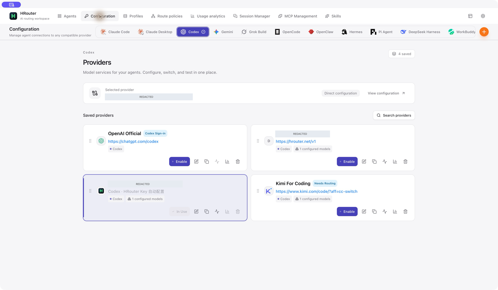
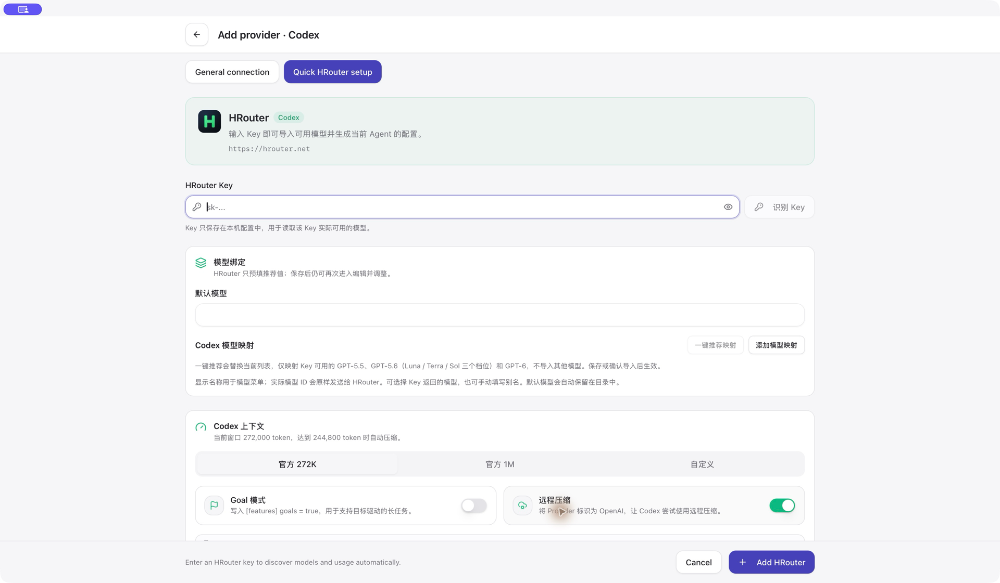
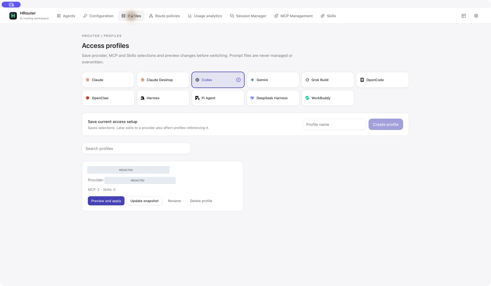
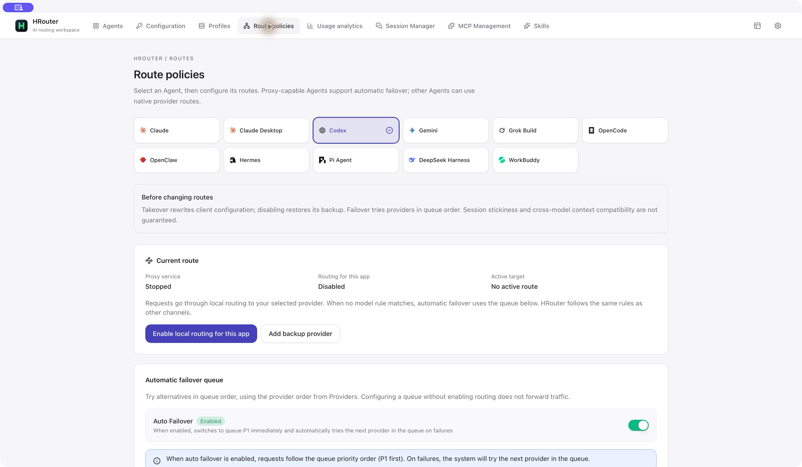
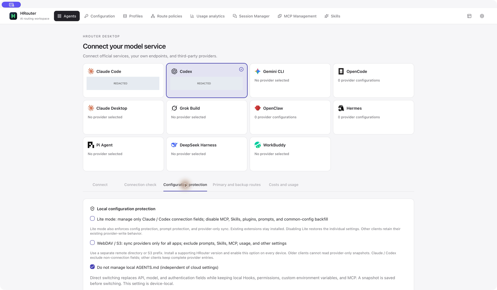
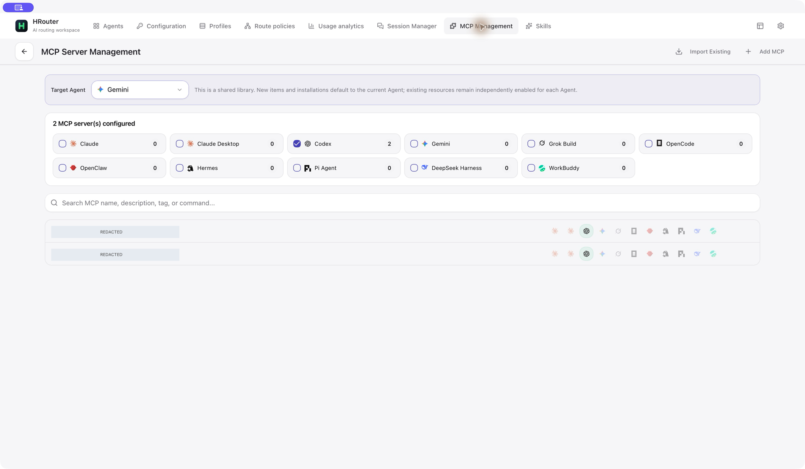
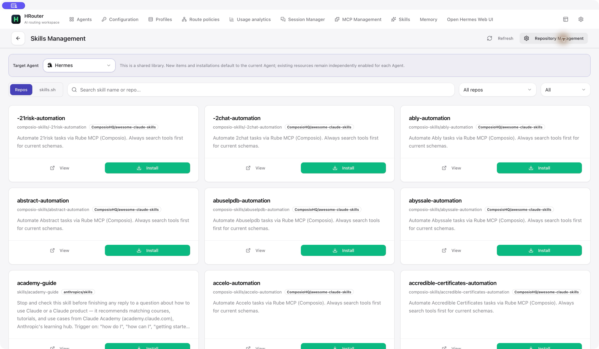
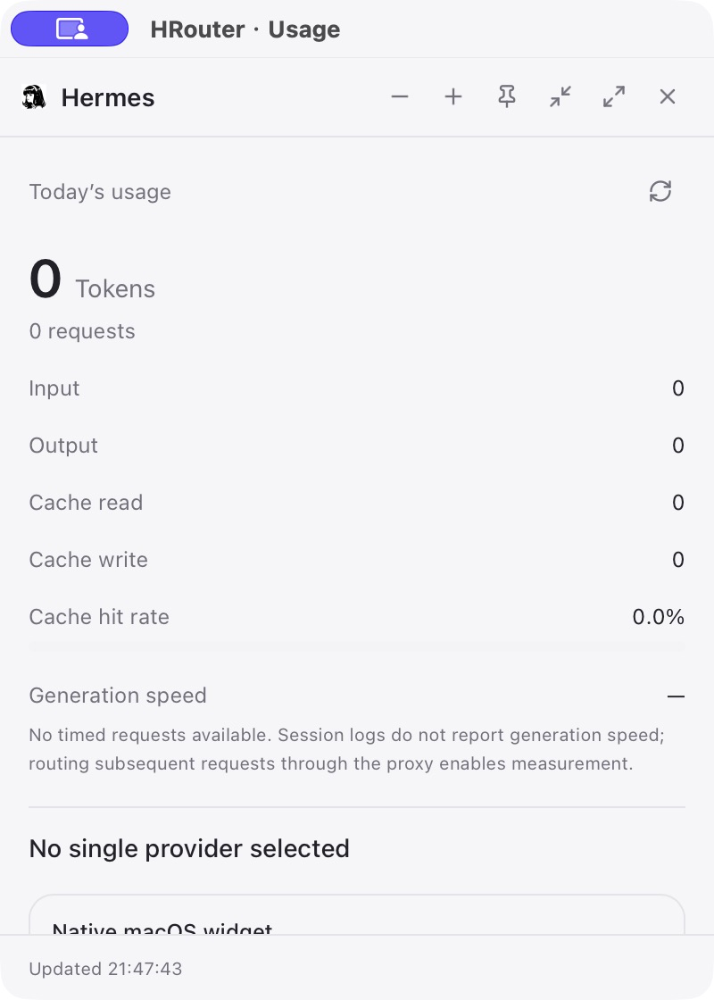

<div align="center">


# HRouter Desktop

### 少折腾配置，多专注编程。

**一个桌面工具，管理你的 AI 编程 Agent、供应商与模型线路。**<br>
接入服务，检查配置，选好备用线路，回到开发本身。

[](https://github.com/honestTai/HRouter-Desktop/releases/latest)
[](#下载)
[](LICENSE)

[English](README.md) | **简体中文**

[下载](#下载) · [为什么选择 HRouter Desktop](#为什么选择-hrouter-desktop) · [界面预览](#界面预览) · [相比 CC Switch 的改动](#相比-cc-switch-的改动) · [开始使用](#开始使用)

</div>


## 为什么选择 HRouter Desktop？

不同的 Agent，不同的配置文件，不同的供应商。切换编程环境，不应该意味着把这些东西重新拼一遍。

**HRouter Desktop 把接入流程集中到一处：**供应商、API Key、模型映射、配置保护、备用线路和用量。它基于 CC Switch，提供以 Agent 为中心的界面，让你围绕自己选择的服务开展工作。

- **11 个 Agent，一个工作台。** 在 Claude Code、Codex、Gemini CLI 等工具间切换，不必为每个工具重新熟悉一套配置界面。
- **先看变更，再切配置。** 主动开启 Claude / Codex 配置保护，保留自定义字段、预览变更，并留存本地切换快照。
- **为模型准备备用线路。** 选择主备供应商、定义精确模型路由，在支持的本地代理模式下自动故障转移。
- **常用配置，存成方案。** 将供应商、MCP 和 Skills 的选择保存为接入方案，应用之前先检查。
- **看清工具怎么用、用了多少。** 查看请求、Token、缓存和费用估算，用浮动窗口随时了解当前 Agent 用量。
- **服务由你选。** 官方供应商、自建端点、兼容中转都能接入；使用桌面工具不需要 HRouter 账户。

## 下载

| 平台        | 安装包                                                                                            | 架构                                         |
| ----------- | ------------------------------------------------------------------------------------------------- | -------------------------------------------- |
| **macOS**   | [前往 Releases 下载](https://github.com/honestTai/HRouter-Desktop/releases/latest) · `.dmg`       | Universal：Apple Silicon + Intel · macOS 12+ |
| **Windows** | [前往 Releases 下载](https://github.com/honestTai/HRouter-Desktop/releases/latest) · `-setup.exe` | x64                                          |

> **v0.4.0 预览：**本文介绍 `main` 分支上重做后的工作台。v0.4.0 尚未公开发布，下载链接目前指向 v0.3.1。可用安装包以 [Releases](https://github.com/honestTai/HRouter-Desktop/releases) 为准。

[更新记录](CHANGELOG.md) · [代码签名政策](CODE_SIGNING_POLICY.md)

## 用 HRouter 快速接入

<table>
<tr>
<td width="110" align="center"><a href="https://hrouter.net/"></a></td>
<td>
<strong>一个 HRouter Key，让你的 Agent 少一步配置。</strong><br><br>
已有 HRouter API Key？选择 Agent，发现 Key 可用的模型，再检查生成的配置——在工作台里完成接入。<br><br>
<a href="https://hrouter.net/"><strong>了解 HRouter →</strong></a> · 服务账户在网站管理，编程工具在桌面接入。
</td>
</tr>
</table>

HRouter 快捷接入是可选项，其他兼容供应商使用同一个工作台。可用模型和价格取决于 Key 权限与服务本身。桌面端不内置 HRouter 账户、充值或订单管理页面。

## 功能介绍

### 接入与验证

- **供应商配置库：**支持官方预设、自定义端点，以及每个 Agent 的多套供应商配置；Key 和模型映射可编辑。
- **HRouter 快捷配置：**通过 Key 发现模型，生成 Agent 专属配置，无需登录平台账户。
- **接入体检：**先检查模型目录，再按需验证普通响应、流式、工具调用及工具结果续接。真实请求体检支持 Claude / Codex API Key 供应商，执行前需确认可能产生费用。

### 保护与复用

- **配置保护：**主动开启 Claude / Codex 字段保留式切换、变更预览、本地快照及冲突检查恢复。
- **Lite 模式：**只关注接入配置，不执行应用管理的 MCP、Skills 或提示词写入；包含提示词保护和仅供应商同步范围。
- **接入方案：**保存并重新应用供应商、MCP 和 Skills 的选择。方案引用供应商，不是完整配置备份。
- **多环境目标：**将支持的 Claude / Codex API Key 配置预览并部署到已有、可访问的 Windows / WSL 配置目录。

### 线路与用量

- **主备线路：**通过本地代理使用有序故障转移队列和精确模型线路链。供应商由你选择，不会自动加入 HRouter。
- **用量统计：**查看请求日志、Token 与缓存明细、趋势、供应商/模型汇总，以及本地费用估算。
- **供应商用量：**查询已配置的用量接口；查看多 Key 额度，并按明确规则合计互相独立的余额。
- **桌面可见：**Agent 浮动用量窗口与 macOS 小组件集成。

### Agent 工作区管理

- **会话：**浏览支持的本地 Agent 对话，在对应客户端恢复工作。
- **MCP 与 Skills：**共享资源按 Agent 独立启用，支持 Skills 发现及相应的导入、导出和备份流程。
- **专属工具：**OpenClaw 工作区文件、环境变量、工具权限和默认配置；Hermes 记忆与用户档案编辑。
- **日常辅助：**CLI 安装/更新入口、语言与主题偏好、应用内帮助。

### 支持的 Agent

**Claude Code · Claude Desktop · Codex · Gemini CLI · Grok Build · OpenCode · OpenClaw · Hermes · Pi Agent · DeepSeek Harness · WorkBuddy**

每个 Agent 使用独立适配器。线路、配置保护、认证、MCP、Skills 和用量的支持范围因 Agent 而异；CLI 安装入口并不负责安装所有 Agent 的桌面应用。具体范围与行为见[接入说明](docs/access-workbench.md)。

## 界面预览

以下为真实 macOS 应用截图，私人配置名称已遮盖。切换为英文界面后，部分 HRouter 专属控件仍显示中文。[截图说明与完整图片索引](assets/screenshots/README.md)。

|                  **供应商，集中管理**                  |                       **HRouter Key，快捷接入**                       |
| :----------------------------------------------------: | :-------------------------------------------------------------------: |
|  |  |
|           已保存的服务与当前供应商一目了然。           |                     保存前先发现模型、检查映射。                      |

|            **常用接入，保存为方案**             |                **备用线路，顺序明确**                 |
| :---------------------------------------------: | :---------------------------------------------------: |
|  |  |
|           保存一套下次还能用的选择。            |              自己决定供应商的尝试顺序。               |

<details>
<summary><strong>配置保护、MCP、Skills 与桌面用量</strong></summary>

|                 **保护本地配置**                  |             **管理 MCP 资源**              |
| :-----------------------------------------------: | :----------------------------------------: |
|  |  |





</details>

## 相比 CC Switch 的改动

**CC Switch 提供基础，HRouter Desktop 重新组织使用方式。** 我们保留上游的供应商、代理、MCP、Skills、会话和用量基础能力，不把它们包装成本项目的新发明。

| 方向                   | 本分支的改动                                                                                  |
| ---------------------- | --------------------------------------------------------------------------------------------- |
| **Agent 优先的界面**   | 重做工作台与顶部导航，独立组织配置中心、接入方案、线路策略和用量页面。                        |
| **明确可控的配置变更** | 引入预览、指纹检查、快照、受保护恢复、Lite 模式和提示词保护组成的配置保护流程。               |
| **可复用的接入组合**   | 提供供应商、MCP 和 Skills 选择的专属方案，应用之前先预览。                                    |
| **按模型组织线路**     | 在继承的代理基础上扩展精确模型主备链、临时手动优先和受控的多 Key 额度合计。                   |
| **兼容性与会话连续性** | 按协议体检、针对性代理传输修复，以及不改写对话历史的 Codex 旧 provider 兼容。                 |
| **用量准确性**         | 针对 Codex fork 用量、Claude 缓存 TTL 估算、OpenCode 汇总去重的修复。                         |
| **HRouter 与桌面集成** | 可选的 HRouter Key 配置、DeepSeek Harness / WorkBuddy 接入工作，以及 Agent 维度桌面用量工具。 |
| **专注工具本身**       | v0.4.0 移除的是旧版 **HRouter** 的账户、支付、订单和云端账单模块，而非 CC Switch 的模块。     |

这里总结的是本分支持续维护的改动，不代表当前上游缺少表中所有能力。两个项目独立演进。实现细节与验证边界见[工作台说明](docs/access-workbench.md)、[修复清单](docs/issue-remediation.md)和[上游贡献记录](docs/upstream-contributions.md)。

## 开始使用

1. **安装并选择 Agent。** 打开工作台，选择要配置的编程工具。
2. **接入服务。** 添加供应商预设，或填写自定义端点与 Key。HRouter 用户选择 **添加 HRouter Key**，检查发现的模型。
3. **检查、保存、启用。** 确认模型映射与配置，再启用供应商。按需刷新或重启目标客户端。

基本接入就完成了。需要时再添加配置保护、接入方案或备用线路；先检查模型目录，再主动选择可能计费的真实请求体检。

### 从 CC Switch 迁移？

在 **工作台 → 开放接入 → 从 CC Switch 迁移** 中选择实际的 `cc-switch.db` 文件，只读预览后再导入所需供应商。导入器不会修改源数据库、覆盖已有条目或激活导入的供应商。

迁移的是供应商，不是整个账户。托管 OAuth 登录态、提示词、Skills、用量脚本和 OMO 配置不在迁移范围内。已有 HRouter 用户升级时，无需删除 Key 或配置目录。

## 使用须知

- **本地优先，不等于完全离线。** 供应商调用、模型发现、用量查询、Skills 发现、定价和更新会访问相应服务。本地 Key、配置文件和快照都应作为敏感数据保管。
- **费用估算，不是账单。** 用量取决于可用的本地记录与配置价格。体检通过不保证模型身份、质量或长任务稳定性。
- **保护有明确范围。** Claude / Codex 配置保护需要主动开启。恢复检查会保留后续编辑，而非强行覆盖；仅供应商同步和接入方案不等于完整备份。
- **签名类型有区别。** Tauri 更新签名不等于 Windows Authenticode 签名；macOS 发布要求 Developer ID 签名与公证。

[隐私政策](PRIVACY.md) · [安全反馈](SECURITY.md) · [签名政策](CODE_SIGNING_POLICY.md)

## 构建与贡献

技术栈：**Tauri 2 · Rust · React · TypeScript**。请使用项目锁文件、`pnpm@10.12.3`，并准备对应平台的 Tauri 构建依赖。

```bash
git clone https://github.com/honestTai/HRouter-Desktop.git
cd HRouter-Desktop
pnpm install --frozen-lockfile
pnpm dev
```

`pnpm build` 为当前平台构建安装包。检查命令与贡献规范见[贡献指南](CONTRIBUTING.md)，发布配置见 [macOS 签名说明](docs/macos-signing.md)。

发现问题，或者有想改进的使用流程？欢迎[提交 Issue](https://github.com/honestTai/HRouter-Desktop/issues)。如果 HRouter Desktop 对你有帮助，也欢迎给仓库一个 Star。

## 致谢与许可证

基于 **Jason Young** 及贡献者开发的 **[CC Switch](https://github.com/farion1231/cc-switch)**。HRouter Desktop 由 [honestTai](https://github.com/honestTai) 与 HRouter Contributors 独立维护，不是 CC Switch 官方发行版，也不代表上游维护者背书。

项目保留原作者版权与 MIT 许可证。部分内部 `cc-switch` 标识继续用于兼容与迁移。

[MIT 许可证](LICENSE) · [归属声明](NOTICE.md)
