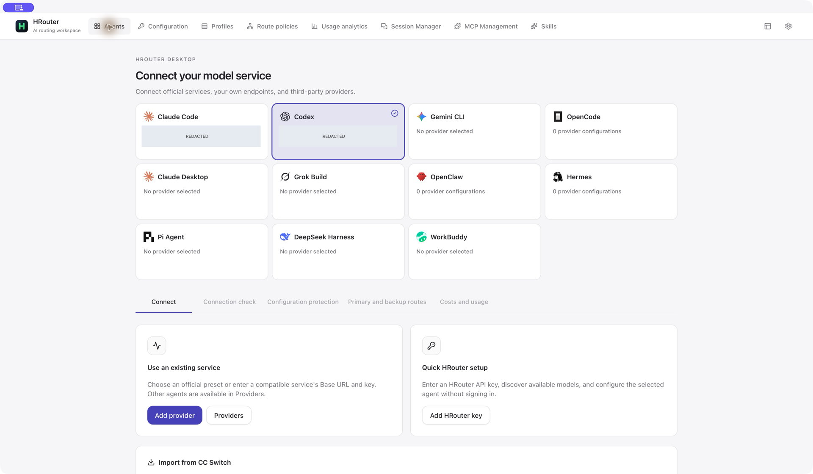

<div align="center">


# HRouter Desktop

[English](README.md) | 简体中文

**你的 Agent，你的供应商，一个专注的桌面工作台。**

[下载](https://github.com/honestTai/HRouter-Desktop/releases/latest) · [主要功能](#主要功能) · [与 CC Switch 的区别](#相比-cc-switch改了哪些东西) · [界面截图](README.md#screenshots)

**macOS · Windows · 本地优先 · MIT 开源**

</div>



## 为你的 Agent 选择服务，而不是围绕平台账户使用工具

**HRouter Desktop 是一个本地优先的 AI 编程工具配置工作台。** 集中管理供应商、API Key、模型映射、接入方案、线路和用量，同时支持官方服务、自建端点以及其他兼容 API。

核心流程：**选择 Agent → 添加服务 → 检查兼容性 → 保护本地配置 → 按需启用主备线路 → 查看用量。**

v0.4.0 将重做后的工作台作为主线，移除了旧版 HRouter 内置的平台登录、账户管理、充值、订单、公告和云端账单。**HRouter 仅保留可选的 Key 快捷配置；无需桌面端平台登录，也不强制购买或使用 HRouter 服务。**

## HRouter 推广

> **已有 HRouter Key？让它直接接入你的编程工具。**
>
> 选择 Agent，粘贴 Key，发现该 Key 可用的模型，检查映射和生成的配置，再保存使用。少花时间手改配置，把时间留给开发。
>
> **[访问 HRouter →](https://hrouter.net/)**
>
> 服务账户和密钥在网站管理，编程工具在桌面配置。模型、价格和服务条款以网站及实际 Key 权限为准。这里是项目服务推广，不是功能使用门槛；其他兼容供应商同样可以正常接入。

## 主要功能

| 功能                   | 说明                                                                                                                                             |
| ---------------------- | ------------------------------------------------------------------------------------------------------------------------------------------------ |
| Agent 工作台与配置中心 | 同一处选择工具、保存多套供应商、查看当前接入、编辑和切换配置。                                                                                   |
| HRouter Key 快捷配置   | 无需平台登录；发现模型、调整 Agent 专属映射、检查生成配置。                                                                                      |
| 接入体检               | 支持范围内的 Claude / Codex API Key 供应商可检查模型目录；主动确认后再测试普通响应、流式、工具调用和工具结果续接。真实请求可能计费。             |
| 配置保护与 Lite 模式   | Claude / Codex 按范围保留自定义字段；切换前预览、留存本地快照、恢复时检查冲突。Lite 模式停用应用管理的 MCP、Skills、提示词写入，并限制同步范围。 |
| 接入方案               | 保存供应商、MCP、Skills 的选择，应用前预览；不是完整配置备份，供应商后续修改仍会影响引用它的方案。                                               |
| 模型线路与故障转移     | 配置有序主备队列和精确模型匹配；支持的 Agent 可主动开启本地代理，不会自动加入 HRouter 渠道。                                                     |
| 本地用量与费用         | 请求、Token、缓存、趋势、供应商/模型汇总及计价规则；支持已配置的供应商用量查询，不等同于真实账单。                                               |
| 会话与 Codex 兼容      | 浏览并恢复支持的本地会话；针对旧 provider 标识维护运行时兼容，不改写历史对话。                                                                   |
| MCP、Skills 与专属工具 | 按 Agent 管理资源；包含 Skills 发现和支持的导入/备份流程，以及 OpenClaw 工作区配置、Hermes 记忆等专属页面。                                      |
| 桌面辅助与迁移         | CLI 安装/更新入口、浮动用量窗口、macOS 小组件集成、语言主题设置；只读预览 CC Switch 数据库并选择性导入供应商。                                   |

支持：**Claude Code、Claude Desktop、Codex、Gemini CLI、Grok Build、OpenCode、OpenClaw、Hermes、Pi Agent、DeepSeek Harness、WorkBuddy。**

各 Agent 的配置、代理、MCP、Skills、认证和用量能力并不完全一致。配置保护、真实请求体检、多环境部署都有明确范围，详见[接入工作台说明](docs/access-workbench.md)。

## 相比 CC Switch，改了哪些东西？

首先保留上游贡献：**供应商切换、代理与协议转换、基础故障转移、MCP、Skills、提示词、会话、用量和同步基础设施并非本项目原创。** HRouter 是独立分支，不代表 CC Switch 官方，也不宣称以下能力都是“上游没有的”。

本分支持续维护的改动主要包括：

1. **重做交互结构**：顶部导航、Agent 优先的工作台，配置中心、接入方案、线路与用量分开组织；设置收敛为常用项和关于页。
2. **保留轻量 HRouter 接入**：Key 识别、模型映射、生成配置和供应商用量；删除的是旧版 **HRouter 自己的**账户、充值及云端账单模块，并非声称 CC Switch 有这些模块。
3. **增加显式保护流程**：配置差异预览、指纹校验、本地快照、冲突恢复、Lite 模式、独立提示词保护和仅供应商同步范围。
4. **增加接入方案与模型级线路工作流**：保存并预览应用选择；在已有代理基础上扩展精确模型主备链、临时手动优先和有条件的多 Key 额度合计。
5. **加强接入验证和针对性修复**：按协议检查真实响应、流式和工具续接；维护代理传输修复、Codex 会话标识兼容、fork 用量、Claude 缓存 TTL、OpenCode 汇总去重等改动。
6. **扩展 Agent 与桌面体验**：维护 DeepSeek Harness / WorkBuddy 接入、Agent 维度用量窗口和 macOS 小组件；另有只读迁移及独立 Windows / WSL 目标配置流程。

这些是本分支的实现范围，不是“全面优于上游”的承诺，也不代表上游相关 Issue 已全部解决。英文[改动对照表](README.md#what-changed-from-cc-switch)保留了比较基准；[修复与验收清单](docs/issue-remediation.md)列出已验证和未覆盖的边界。

## 截图与安装

[界面截图](README.md#screenshots)精选了真实 macOS 窗口，包含 Key 配置、配置中心、体检、保护、接入方案、线路、会话、MCP、Skills 和桌面组件。私人配置名称已做不可逆遮盖；没有填入真实 Key，也没有伪造模型请求或用量数据。英文界面中仍有少量 HRouter 专属中文文案，如实保留。

- 从 [GitHub Releases](https://github.com/honestTai/HRouter-Desktop/releases/latest) 下载**已经公开发布**的安装包：macOS Universal DMG 或 Windows x64 EXE。
- **截至 2026 年 10 月 3 日**：主分支版本为 v0.4.0，Windows 包已构建；macOS 公证仍等待 Apple 开发者协议更新，因此 v0.4.0 保持草稿，公开最新版仍为 v0.3.1。
- 安装后选择 Agent，添加普通供应商或已有 HRouter Key，检查模型和配置，再保存并启用。按客户端要求重启或刷新。
- 从 CC Switch 迁移时选择实际数据库，先只读预览，再导入所需供应商；不会激活导入项或修改源库，也不会迁移 OAuth 登录态、提示词、Skills、用量脚本等排除项。
- 老版 HRouter 升级无需清空 Key 或配置。账户、充值和订单请在网站操作。

## 隐私、边界与开源归属

本地优先不等于完全离线：模型发现、供应商调用、用量查询、Skills 发现和更新等会访问相应服务。Key 和快照可能以配置文件形式保存在本机，请勿随截图、Issue 或备份公开。费用是本地估算，体检通过也不保证上游模型身份、质量或长任务稳定性。

项目基于 **CC Switch**，保留 **Jason Young** 及原作者的 MIT 版权和归属。HRouter 品牌与产品改动独立维护，不代表上游官方发行或背书。

[隐私政策](PRIVACY.md) · [安全反馈](SECURITY.md) · [许可证](LICENSE) · [归属声明](NOTICE.md) · [参与开发](#开发与构建)

## 开发与构建

技术栈为 **Tauri 2、Rust、React 和 TypeScript**。使用项目锁文件及 `pnpm@10.12.3`，构建前准备对应平台的 Tauri 依赖。

```bash
git clone https://github.com/honestTai/HRouter-Desktop.git
cd HRouter-Desktop
pnpm install --frozen-lockfile
pnpm dev
```

```bash
pnpm typecheck
pnpm format:check
pnpm test:unit
pnpm build:renderer
cargo fmt --check --manifest-path src-tauri/Cargo.toml
cargo clippy --manifest-path src-tauri/Cargo.toml -- -D warnings
cargo test --manifest-path src-tauri/Cargo.toml
```

`pnpm build` 生成当前平台安装包。Windows 安装包在 Windows 环境构建；macOS 正式发布流程构建 Universal 包，并完成签名和 Apple 公证。v0.4.0 的发布关卡会等待 CI、两端安装包及合并后的签名更新清单验证完成，再公开发布。

[macOS 签名说明](docs/macos-signing.md) · [贡献指南](CONTRIBUTING.md) · [更新记录](CHANGELOG.md)

---

由 [honestTai](https://github.com/honestTai) 维护。基于 CC Switch，感谢上游作者与所有贡献者。
